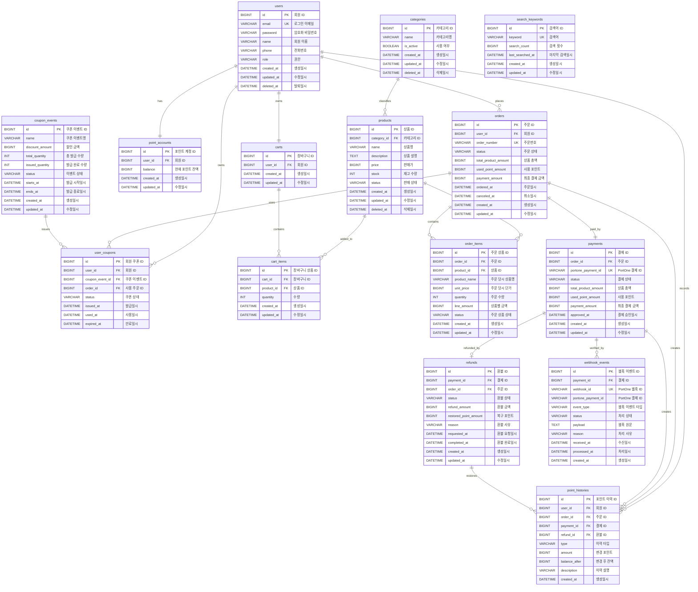

# ERD

`docs/api` 명세를 기준으로 커머스 프로젝트에서 사용하는 테이블과 관계를 정리합니다.

## 관계도

## 테이블 정의

### users

회원가입, 로그인, 내 정보 조회, 회원 탈퇴의 기준 테이블입니다.

| 논리명 | 컬럼명 | 타입 | NULL | 제약/비고 |
| --- | --- | --- | --- | --- |
| 회원 ID | id | BIGINT | NOT NULL | PK |
| 로그인 이메일 | email | VARCHAR(100) | NOT NULL | UNIQUE |
| 암호화 비밀번호 | password | VARCHAR(255) | NOT NULL | 응답에 포함하지 않음 |
| 회원 이름 | name | VARCHAR(50) | NOT NULL |  |
| 전화번호 | phone | VARCHAR(30) | NOT NULL |  |
| 권한 | role | VARCHAR(30) | NOT NULL | USER, ADMIN |
| 생성일시 | created_at | DATETIME | NOT NULL |  |
| 수정일시 | updated_at | DATETIME | NULL |  |
| 탈퇴일시 | deleted_at | DATETIME | NULL | 회원 탈퇴 시 값 저장 |

### carts

회원별 장바구니를 저장합니다. 회원가입 성공 시 기본 장바구니를 생성합니다.

| 논리명 | 컬럼명 | 타입 | NULL | 제약/비고 |
| --- | --- | --- | --- | --- |
| 장바구니 ID | id | BIGINT | NOT NULL | PK |
| 회원 ID | user_id | BIGINT | NOT NULL | FK: users.id, UNIQUE |
| 생성일시 | created_at | DATETIME | NOT NULL |  |
| 수정일시 | updated_at | DATETIME | NULL |  |

### cart_items

장바구니에 담긴 상품과 수량을 저장합니다.

| 논리명 | 컬럼명 | 타입 | NULL | 제약/비고 |
| --- | --- | --- | --- | --- |
| 장바구니 상품 ID | id | BIGINT | NOT NULL | PK |
| 장바구니 ID | cart_id | BIGINT | NOT NULL | FK: carts.id |
| 상품 ID | product_id | BIGINT | NOT NULL | FK: products.id |
| 수량 | quantity | INT | NOT NULL | 1 이상 |
| 생성일시 | created_at | DATETIME | NOT NULL |  |
| 수정일시 | updated_at | DATETIME | NULL |  |

- 같은 장바구니에 같은 상품은 한 번만 담기도록 `(cart_id, product_id)`에 UNIQUE 제약을 둡니다.

### categories

상품 목록/상세 응답의 `categoryId`, `categoryName`을 위한 내부 분류 테이블입니다.

| 논리명 | 컬럼명 | 타입 | NULL | 제약/비고 |
| --- | --- | --- | --- | --- |
| 카테고리 ID | id | BIGINT | NOT NULL | PK |
| 카테고리명 | name | VARCHAR(50) | NOT NULL |  |
| 사용 여부 | is_active | BOOLEAN | NOT NULL | 기본값 true |
| 생성일시 | created_at | DATETIME | NOT NULL |  |
| 수정일시 | updated_at | DATETIME | NULL |  |
| 삭제일시 | deleted_at | DATETIME | NULL |  |

### products

상품 목록 조회, 상품 상세 조회, 상품 검색의 기준 테이블입니다.

| 논리명 | 컬럼명 | 타입 | NULL | 제약/비고 |
| --- | --- | --- | --- | --- |
| 상품 ID | id | BIGINT | NOT NULL | PK |
| 카테고리 ID | category_id | BIGINT | NULL | FK: categories.id |
| 상품명 | name | VARCHAR(100) | NOT NULL |  |
| 상품 설명 | description | TEXT | NULL |  |
| 판매가 | price | BIGINT | NOT NULL | 원화 정수 |
| 재고 수량 | stock | INT | NOT NULL | 0 이상 |
| 판매 상태 | status | VARCHAR(30) | NOT NULL | ON_SALE, SOLD_OUT, DISCONTINUED |
| 생성일시 | created_at | DATETIME | NOT NULL |  |
| 수정일시 | updated_at | DATETIME | NULL |  |
| 삭제일시 | deleted_at | DATETIME | NULL | 사용자 조회에서 제외 |

### orders

주문 생성, 주문 목록/상세 조회, 결제 전 주문 취소의 기준 테이블입니다.

| 논리명 | 컬럼명 | 타입 | NULL | 제약/비고 |
| --- | --- | --- | --- | --- |
| 주문 ID | id | BIGINT | NOT NULL | PK |
| 회원 ID | user_id | BIGINT | NOT NULL | FK: users.id |
| 주문번호 | order_number | VARCHAR(50) | NOT NULL | UNIQUE |
| 주문 상태 | status | VARCHAR(30) | NOT NULL | PAYMENT_PENDING, COMPLETED, CANCELED, REFUND_REQUESTED, REFUNDED |
| 상품 총액 | total_product_amount | BIGINT | NOT NULL | 주문 상품 합계 |
| 사용 포인트 | used_point_amount | BIGINT | NOT NULL | 기본값 0 |
| 최종 결제 금액 | payment_amount | BIGINT | NOT NULL | 상품 총액 - 사용 포인트 |
| 주문일시 | ordered_at | DATETIME | NOT NULL |  |
| 취소일시 | canceled_at | DATETIME | NULL | 결제 전 취소 시 값 저장 |
| 생성일시 | created_at | DATETIME | NOT NULL |  |
| 수정일시 | updated_at | DATETIME | NULL |  |

### order_items

주문 당시의 상품명과 가격을 스냅샷으로 저장합니다.

| 논리명 | 컬럼명 | 타입 | NULL | 제약/비고 |
| --- | --- | --- | --- | --- |
| 주문 상품 ID | id | BIGINT | NOT NULL | PK |
| 주문 ID | order_id | BIGINT | NOT NULL | FK: orders.id |
| 상품 ID | product_id | BIGINT | NOT NULL | FK: products.id |
| 주문 당시 상품명 | product_name | VARCHAR(100) | NOT NULL | 상품명 스냅샷 |
| 주문 당시 단가 | unit_price | BIGINT | NOT NULL | 가격 스냅샷 |
| 주문 수량 | quantity | INT | NOT NULL | 1 이상 |
| 상품별 금액 | line_amount | BIGINT | NOT NULL | unit_price * quantity |
| 주문 상품 상태 | status | VARCHAR(30) | NOT NULL | ORDERED, CANCELED, REFUNDED |
| 생성일시 | created_at | DATETIME | NOT NULL |  |
| 수정일시 | updated_at | DATETIME | NULL |  |

### payments

결제 승인 검증과 결제 상세 조회의 기준 테이블입니다.

| 논리명 | 컬럼명 | 타입 | NULL | 제약/비고 |
| --- | --- | --- | --- | --- |
| 결제 ID | id | BIGINT | NOT NULL | PK |
| 주문 ID | order_id | BIGINT | NOT NULL | FK: orders.id, UNIQUE |
| PortOne 결제 ID | portone_payment_id | VARCHAR(100) | NULL | UNIQUE, 결제 승인 검증 시 저장 가능 |
| 결제 상태 | status | VARCHAR(30) | NOT NULL | PENDING, PAID, FAILED, CANCELED, REFUNDED |
| 상품 총액 | total_product_amount | BIGINT | NOT NULL | 서버 계산 값 |
| 사용 포인트 | used_point_amount | BIGINT | NOT NULL | 서버 계산 값 |
| 최종 결제 금액 | payment_amount | BIGINT | NOT NULL | PortOne 승인 금액과 비교 |
| 결제 승인일시 | approved_at | DATETIME | NULL |  |
| 생성일시 | created_at | DATETIME | NOT NULL |  |
| 수정일시 | updated_at | DATETIME | NULL |  |

### refunds

결제 완료 이후 환불 요청을 저장합니다.

| 논리명 | 컬럼명 | 타입 | NULL | 제약/비고 |
| --- | --- | --- | --- | --- |
| 환불 ID | id | BIGINT | NOT NULL | PK |
| 결제 ID | payment_id | BIGINT | NOT NULL | FK: payments.id, 중복 환불 방지를 위해 UNIQUE 권장 |
| 주문 ID | order_id | BIGINT | NOT NULL | FK: orders.id |
| 환불 상태 | status | VARCHAR(30) | NOT NULL | REQUESTED, APPROVED, REJECTED, COMPLETED, FAILED |
| 환불 금액 | refund_amount | BIGINT | NOT NULL | 서버 계산 값 |
| 복구 포인트 | restored_point_amount | BIGINT | NOT NULL | 기본값 0 |
| 환불 사유 | reason | VARCHAR(255) | NOT NULL |  |
| 환불 요청일시 | requested_at | DATETIME | NOT NULL |  |
| 환불 완료일시 | completed_at | DATETIME | NULL |  |
| 생성일시 | created_at | DATETIME | NOT NULL |  |
| 수정일시 | updated_at | DATETIME | NULL |  |

### point_accounts

회원별 현재 포인트 잔액을 관리합니다.

| 논리명 | 컬럼명 | 타입 | NULL | 제약/비고 |
| --- | --- | --- | --- | --- |
| 포인트 계정 ID | id | BIGINT | NOT NULL | PK |
| 회원 ID | user_id | BIGINT | NOT NULL | FK: users.id, UNIQUE |
| 현재 포인트 잔액 | balance | BIGINT | NOT NULL | 0 이상 |
| 생성일시 | created_at | DATETIME | NOT NULL |  |
| 수정일시 | updated_at | DATETIME | NULL |  |

### point_histories

포인트 적립, 사용, 복구, 만료 이력을 저장합니다.

| 논리명 | 컬럼명 | 타입 | NULL | 제약/비고 |
| --- | --- | --- | --- | --- |
| 포인트 이력 ID | id | BIGINT | NOT NULL | PK |
| 회원 ID | user_id | BIGINT | NOT NULL | FK: users.id |
| 주문 ID | order_id | BIGINT | NULL | FK: orders.id |
| 결제 ID | payment_id | BIGINT | NULL | FK: payments.id |
| 환불 ID | refund_id | BIGINT | NULL | FK: refunds.id |
| 이력 타입 | type | VARCHAR(30) | NOT NULL | EARN, USE, RESTORE, EXPIRE |
| 변경 포인트 | amount | BIGINT | NOT NULL | 사용은 음수, 적립/복구는 양수 |
| 변경 후 잔액 | balance_after | BIGINT | NOT NULL |  |
| 이력 설명 | description | VARCHAR(255) | NULL |  |
| 생성일시 | created_at | DATETIME | NOT NULL | 이력 발생 시각 |

### coupon_events

선착순 쿠폰 발급 이벤트를 저장합니다.

| 논리명 | 컬럼명 | 타입 | NULL | 제약/비고 |
| --- | --- | --- | --- | --- |
| 쿠폰 이벤트 ID | id | BIGINT | NOT NULL | PK |
| 쿠폰 이벤트명 | name | VARCHAR(100) | NOT NULL |  |
| 할인 금액 | discount_amount | BIGINT | NOT NULL | 원화 정수 |
| 총 발급 수량 | total_quantity | INT | NOT NULL |  |
| 발급 완료 수량 | issued_quantity | INT | NOT NULL | 기본값 0 |
| 이벤트 상태 | status | VARCHAR(30) | NOT NULL | OPEN, CLOSED |
| 발급 시작일시 | starts_at | DATETIME | NOT NULL |  |
| 발급 종료일시 | ends_at | DATETIME | NOT NULL |  |
| 생성일시 | created_at | DATETIME | NOT NULL |  |
| 수정일시 | updated_at | DATETIME | NULL |  |

### user_coupons

회원이 보유한 쿠폰 목록을 저장합니다.

| 논리명 | 컬럼명 | 타입 | NULL | 제약/비고 |
| --- | --- | --- | --- | --- |
| 회원 쿠폰 ID | id | BIGINT | NOT NULL | PK |
| 회원 ID | user_id | BIGINT | NOT NULL | FK: users.id |
| 쿠폰 이벤트 ID | coupon_event_id | BIGINT | NOT NULL | FK: coupon_events.id |
| 사용 주문 ID | order_id | BIGINT | NULL | FK: orders.id |
| 쿠폰 상태 | status | VARCHAR(30) | NOT NULL | ISSUED, USED, EXPIRED |
| 발급일시 | issued_at | DATETIME | NOT NULL |  |
| 사용일시 | used_at | DATETIME | NULL |  |
| 만료일시 | expired_at | DATETIME | NULL |  |

- 같은 회원이 같은 쿠폰 이벤트에서 중복 발급받지 못하도록 `(user_id, coupon_event_id)`에 UNIQUE 제약을 둡니다.

### webhook_events

PortOne 웹훅 원문과 처리 결과를 저장합니다.

| 논리명 | 컬럼명 | 타입 | NULL | 제약/비고 |
| --- | --- | --- | --- | --- |
| 웹훅 이벤트 ID | id | BIGINT | NOT NULL | PK |
| 결제 ID | payment_id | BIGINT | NULL | FK: payments.id |
| PortOne 웹훅 ID | webhook_id | VARCHAR(100) | NOT NULL | UNIQUE |
| PortOne 결제 ID | portone_payment_id | VARCHAR(100) | NULL |  |
| 웹훅 이벤트 타입 | event_type | VARCHAR(100) | NOT NULL | 예: Transaction.Paid |
| 처리 상태 | status | VARCHAR(30) | NOT NULL | RECEIVED, PROCESSED, FAILED |
| 웹훅 원문 | payload | TEXT | NOT NULL |  |
| 처리 사유 | reason | VARCHAR(100) | NULL | PROCESSED, DUPLICATE_OR_IGNORED 등 |
| 수신일시 | received_at | DATETIME | NOT NULL |  |
| 처리일시 | processed_at | DATETIME | NULL |  |
| 생성일시 | created_at | DATETIME | NOT NULL |  |

### search_keywords

인기 검색어 조회를 위한 검색어 집계 테이블입니다.

| 논리명 | 컬럼명 | 타입 | NULL | 제약/비고 |
| --- | --- | --- | --- | --- |
| 검색어 ID | id | BIGINT | NOT NULL | PK |
| 검색어 | keyword | VARCHAR(100) | NOT NULL | UNIQUE |
| 검색 횟수 | search_count | BIGINT | NOT NULL | 기본값 0 |
| 마지막 검색일시 | last_searched_at | DATETIME | NULL |  |
| 생성일시 | created_at | DATETIME | NOT NULL |  |
| 수정일시 | updated_at | DATETIME | NULL |  |

## 관계 요약

| 관계 | 설명 |
| --- | --- |
| users - carts | 회원은 하나의 기본 장바구니를 가집니다. |
| users - point_accounts | 회원은 하나의 포인트 계정을 가집니다. |
| users - point_histories | 회원은 여러 포인트 이력을 가질 수 있습니다. |
| users - orders | 회원은 여러 주문을 생성할 수 있습니다. |
| users - user_coupons | 회원은 여러 쿠폰을 보유할 수 있습니다. |
| categories - products | 카테고리는 여러 상품을 분류할 수 있습니다. |
| carts - cart_items | 장바구니는 여러 장바구니 상품을 담습니다. |
| products - cart_items | 상품은 여러 장바구니에 담길 수 있습니다. |
| orders - order_items | 주문은 여러 주문 상품을 가집니다. |
| products - order_items | 상품은 주문 상품 스냅샷으로 기록됩니다. |
| orders - payments | 주문은 하나의 결제와 연결됩니다. |
| payments - refunds | 결제 완료 이후 환불 요청이 생성될 수 있습니다. |
| payments - webhook_events | 결제는 여러 웹훅 이벤트와 연결될 수 있습니다. |
| refunds - point_histories | 환불은 포인트 복구 이력을 만들 수 있습니다. |
| coupon_events - user_coupons | 쿠폰 이벤트는 여러 회원 쿠폰을 발급합니다. |
| orders - user_coupons | 쿠폰을 사용한 경우 회원 쿠폰이 주문과 연결됩니다. |
